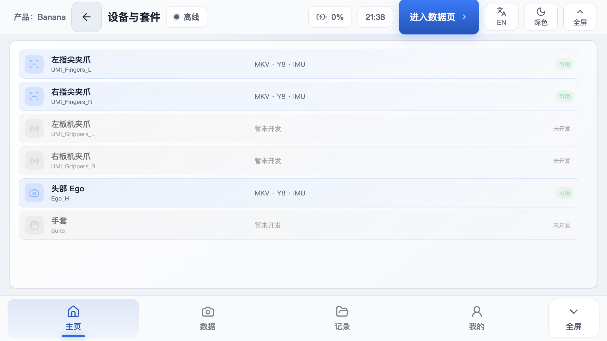
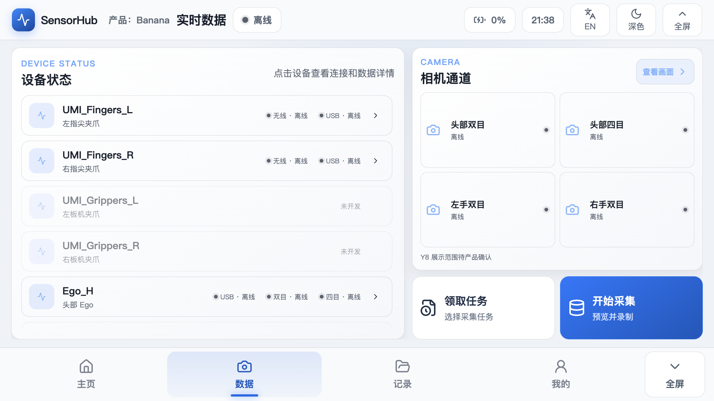
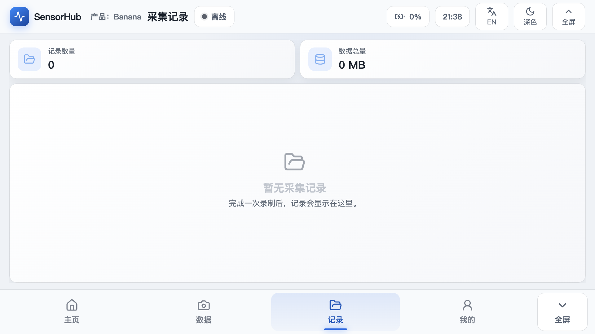

# device-ui — RK3588 设备端界面（SensorHub 数据采集终端）

面向 RK3588 5.5 英寸、1920×1080 横屏触摸屏的设备端 UI。React + TypeScript 前端由 `server.cjs`（Node.js，端口 8080）提供，运行在 Chromium kiosk 全屏模式下。设备离线时前端仍可正常显示，不会白屏。

## 架构

```text
Chromium (kiosk :0)  ←→  Node.js server.cjs (:8080)  ←→  static/ (React 构建产物)
     触摸屏                     后端 API + 静态服务                 前端页面
```

## 界面截图

**首页 · 产品套件**



**数据页 · 实时采集**



**记录页**



## 主导航

底部四个一级入口：

| Tab | 文案 | 说明 |
|-----|------|------|
| Home | 主页 | 产品选择 + 设备/套件列表（Banana / Mango） |
| Data | 数据 | 实时预览、采集、相机、夹爪 |
| Records | 记录 | 录制文件浏览 / 预览 / 解码 / 传输 / 删除 |
| Profile | 我的 | WiFi、蓝牙、设备管理、设置、关于 |

产品套件（Banana）当前设备列表：

| 设备 | 代号 | 状态 |
|------|------|------|
| 左指尖夹爪 | `UMI_Fingers_L` | 可用（MKV · Y8 · IMU） |
| 右指尖夹爪 | `UMI_Fingers_R` | 可用（MKV · Y8 · IMU） |
| 头部 Ego | `Ego_H` | 可用（MKV · Y8 · IMU） |
| 左板机夹爪 | `UMI_Grippers_L` | 暂未开发 |
| 右板机夹爪 | `UMI_Grippers_R` | 暂未开发 |
| 手套 | `Suits` | 暂未开发 |

## 前端结构

源码在 `frontend/src/`，按职责分目录：

| 目录 | 职责 |
|------|------|
| `app/` | 应用控制器、`DeviceShell` 外壳、导航模型、产品选择 |
| `features/home/` | 首页 + 产品套件 |
| `features/data/` | 实时采集、相机、夹爪、任务认领 |
| `features/records/` | 录制记录浏览 |
| `features/profile/` | WiFi、蓝牙、设备管理、设置、关于 |
| `features/expansion/` | 扩展（市场、精选、包下载、账号） |
| `services/deviceApi.ts` | 设备 HTTP API 边界 |
| `shared/` | 中英文 i18n、触屏 UI 原语（`TouchChoice`、`TouchKeyboard`） |
| `styles/` | 物理屏 token、终端布局规则 |

UI 约定：页面根节点不滚动；每个页面对应一个主任务并贴合横屏视口；长列表只在自身面板内滚动；主控件使用设备级触控热区；顶部/底部 chrome 可一起隐藏进入全屏。竖屏为兼容模式，产品目标是固定横屏面板。

## 后端 API

`server.cjs` 提供 Web UI 与设备 API，无第三方运行时依赖（`package.json` 为 `"type": "module"`，故服务文件用 `.cjs` 扩展名）。

| 端口 | 用途 |
|------|------|
| `:8080` | Web UI + API 主端口 |
| `:8888` | 手套校准器代理（`CAL_PORT`） |
| `/tmp/stereo_ctl.sock` | 双目相机控制 Unix socket |

## 开发

建议 Node.js 20 LTS + Corepack 管理的 pnpm。

```bash
corepack enable
pnpm install --frozen-lockfile
pnpm dev            # Vite 开发服务器，默认 http://127.0.0.1:5173/
pnpm build          # 类型检查 + 构建，输出到 static/
pnpm test           # Vitest 单元测试
```

Vite 配置没有开发期 API 代理，本地 dev 主要用于界面与离线状态检查；完整设备联调走构建后的 `server.cjs`。

## 构建与部署

开发机构建，设备只接收产物（推荐）：

```bash
pnpm install --frozen-lockfile
pnpm build
tar -czf sensorhub-static.tar.gz static
scp sensorhub-static.tar.gz root@<设备IP>:/tmp/
```

详细部署 / 回滚 / 检查清单见 [`docs/新版前端开发与部署流程.md`](docs/新版前端开发与部署流程.md)。

## 运行与运维

RK3588 上 SSH 登录后：

```bash
cd /root/ui
bash 01-operation/device-ui-operate.sh start     # 启动
bash 01-operation/device-ui-operate.sh stop      # 停止
bash 01-operation/device-ui-operate.sh restart   # 重启
bash 01-operation/device-ui-operate.sh status    # 状态
bash 01-operation/device-ui-operate.sh log       # 日志
```

本地生产方式验证：

```bash
PORT=8080 RECORD_DIR=/media/usb0/capture node server.cjs
# 浏览器打开 http://127.0.0.1:8080/
```

主要环境变量：

| 变量 | 默认值 | 作用 |
|------|--------|------|
| `PORT` | `8080` | Web UI 和 API 端口 |
| `RECORD_DIR` | `/media/usb0/capture` | 录制目录 |
| `CAL_PORT` | `8888` | 校准器服务端口 |
| `STEREO_CTL_SOCK` | `/tmp/stereo_ctl.sock` | 双目相机控制 socket |

运维细节（日志位置、已知问题、同步脚本）见 [`01-operation/README.md`](01-operation/README.md)。

## 相关文档

- [`docs/新版前端开发与部署流程.md`](docs/新版前端开发与部署流程.md) — 开发与部署全流程
- [`docs/device-ui-interface.md`](docs/device-ui-interface.md) — `unified_capture` 对外接口契约
- [`docs/功能逻辑设计思想.md`](docs/功能逻辑设计思想.md) — 功能设计
- [`docs/前端已实现但后台未支持的功能.md`](docs/前端已实现但后台未支持的功能.md) — 占位功能清单
- [`01-operation/README.md`](01-operation/README.md) — 运维手册
